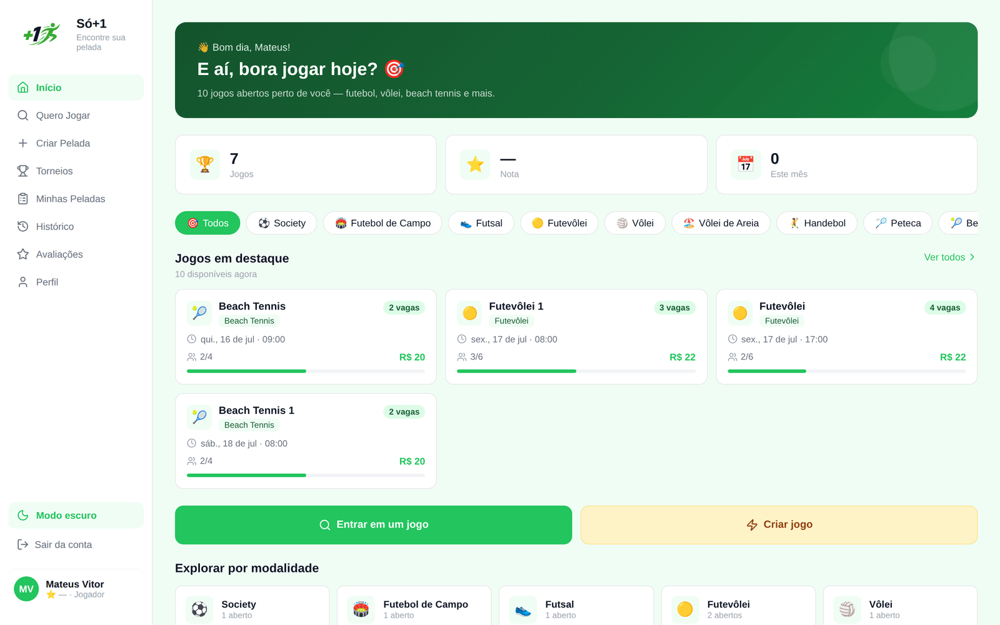
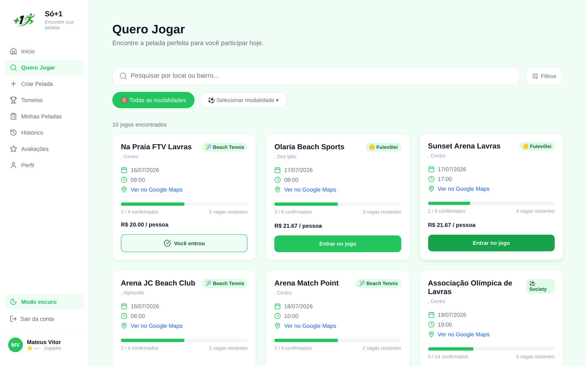
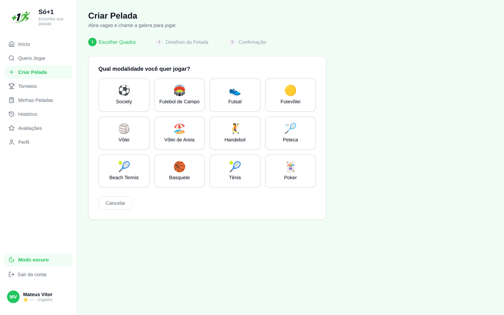
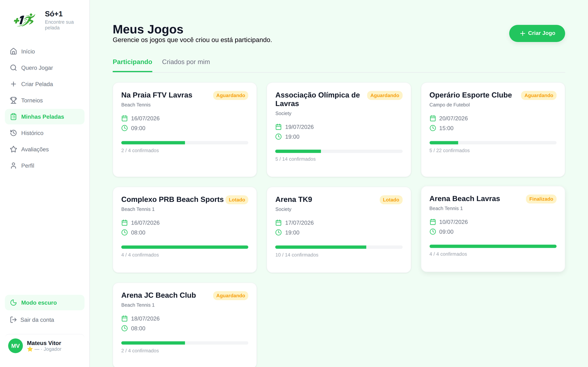
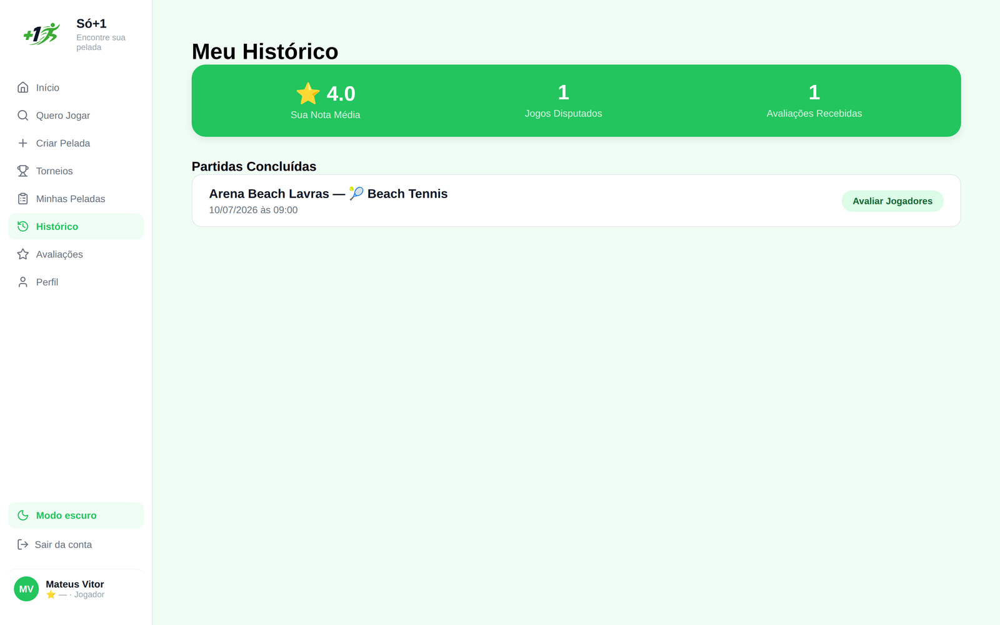
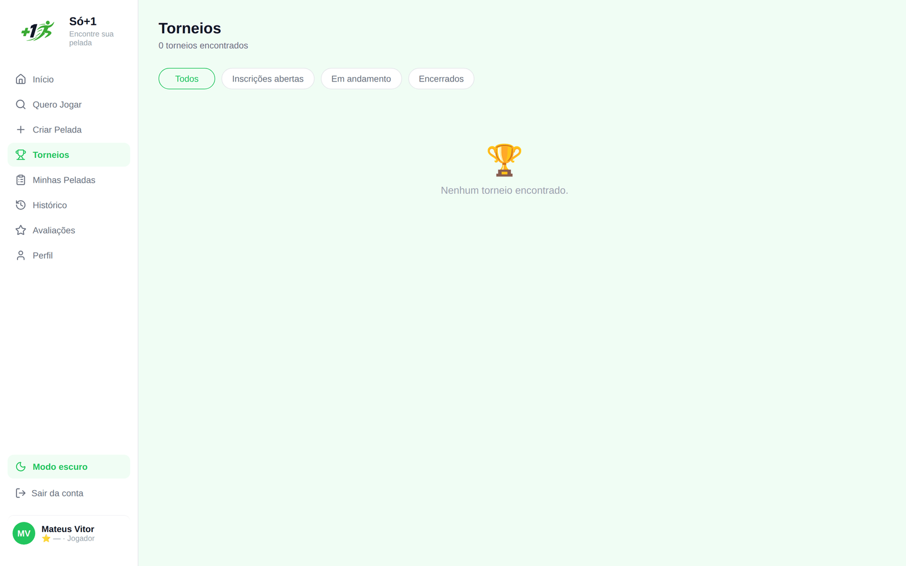
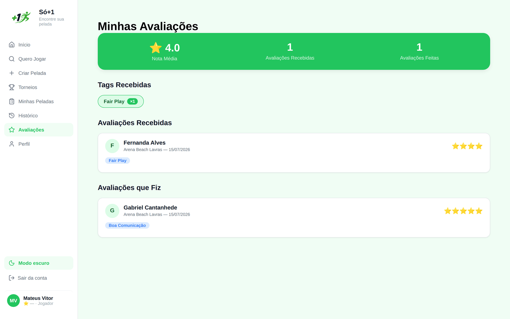
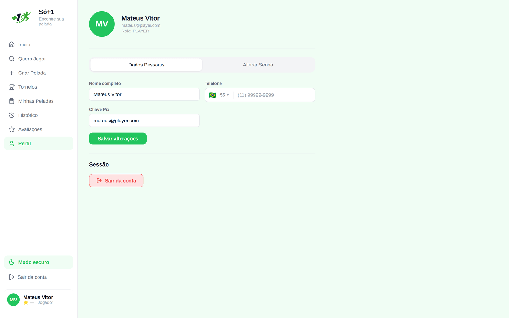
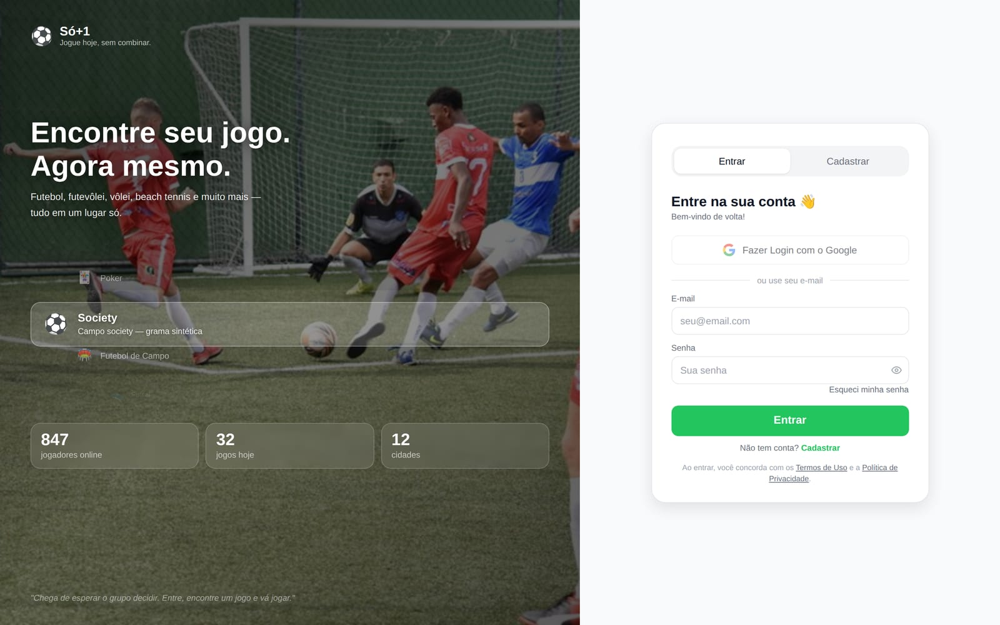

<div align="center">

<h1>🌐 Só+1 — Web App</h1>

<p><strong>Interface web da plataforma de organização de peladas amadoras</strong></p>

<p>
  <a href="https://app.so-mais-um.com" target="_blank">
    
  </a>
</p>

<p>
  
  &nbsp;
  
  
  
  
</p>

</div>

---

## 📋 Índice

- [Telas](#-telas)
- [Stack](#-stack)
- [Instalação local](#-instalação-local)
- [Rotas](#-rotas)
- [Estrutura do projeto](#-estrutura-do-projeto)
- [Requisitos cobertos](#-requisitos-cobertos)
- [Convenções](#-convenções)

---

## 📸 Telas

<div align="center">

**Descubra peladas abertas perto de você e entre com um clique**



</div>

|  Quero Jogar  |  Criar Pelada (wizard)  |
| :-----------: | :---------------------: |
|  |  |
| **Minhas Peladas** | **Histórico** |
|  |  |

<details>
<summary><strong>Mais telas</strong> — torneios, avaliações, perfil e login</summary>

<br/>

|  Torneios  |  Avaliações  |
| :--------: | :----------: |
|  |  |
| **Perfil** | **Login** |
|  |  |

</details>

---

## 🛠️ Stack

<table>
  <tbody>
    <tr>
      <td><strong>UI</strong></td>
      <td>  </td>
    </tr>
    <tr>
      <td><strong>Roteamento</strong></td>
      <td></td>
    </tr>
    <tr>
      <td><strong>Formulários</strong></td>
      <td> </td>
    </tr>
    <tr>
      <td><strong>HTTP</strong></td>
      <td> (interceptors JWT + auto-logout em 401)</td>
    </tr>
    <tr>
      <td><strong>Mapas</strong></td>
      <td> (mapa de quadras em <code>/quero-jogar</code>)</td>
    </tr>
    <tr>
      <td><strong>Animações</strong></td>
      <td> (intro e transições)</td>
    </tr>
    <tr>
      <td><strong>Auth social</strong></td>
      <td></td>
    </tr>
    <tr>
      <td><strong>Ícones</strong></td>
      <td></td>
    </tr>
    <tr>
      <td><strong>Deploy</strong></td>
      <td> (preview por PR · produção em <code>main</code>)</td>
    </tr>
  </tbody>
</table>

---

## 🚀 Instalação local

```bash
# 1. Clonar
git clone https://github.com/mateus-vitor-ferreira-dev/so-mais-um-web.git
cd so-mais-um-web

# 2. Instalar dependências
npm install

# 3. Configurar variáveis de ambiente
cp .env.example .env
```

```ini
# .env
VITE_API_URL=http://localhost:3000
VITE_GOOGLE_CLIENT_ID=<seu_google_client_id>
```

```bash
# 4. Iniciar em desenvolvimento
npm run dev
```

Interface disponível em `http://localhost:5173`

> A [API do Só+1](https://github.com/mateus-vitor-ferreira-dev/so-mais-um-api) deve estar rodando em `http://localhost:3000`.

---

## 🗺️ Rotas

### Públicas

| Rota | Descrição |
|---|---|
| `/` | Intro com animação GSAP |
| `/login` | Login e cadastro |
| `/register` | Cadastro direto |
| `/esqueci-senha` | Solicitar reset de senha |
| `/redefinir-senha` | Redefinir senha com token |
| `/seja-parceiro` | Portal de parceiros — onboarding de OWNER via convite |

### Jogador autenticado (`PLAYER`)

| Rota | Descrição |
|---|---|
| `/home` | Dashboard principal |
| `/perfil` | Editar dados e chave Pix |
| `/quero-jogar` | Buscar peladas (lista + mapa Leaflet) |
| `/criar-pelada` | Wizard 3 etapas para criar pelada |
| `/minhas-peladas` | Jogos criados e participações + sorteio de times |
| `/pelada/:eventId` | Detalhe completo da pelada |
| `/historico` | Partidas finalizadas + avaliar jogadores |
| `/avaliacoes` | Reputação recebida — nota média, tags e reviews |
| `/torneios` | Campeonatos com chaveamento visual |

### Admin (`/admin`)

| Rota | Descrição |
|---|---|
| `/admin/dashboard` | Visão geral da plataforma |
| `/admin/users` | Gestão de usuários, roles e convites de OWNER |
| `/admin/requests` | Solicitações de parceria |
| `/admin/places` | Gestão de espaços esportivos |

### Owner (`/owner`)

| Rota | Descrição |
|---|---|
| `/owner/dashboard` | Dashboard do proprietário |
| `/owner/places` | Gerenciar próprios locais e quadras |
| `/owner/requests` | Solicitações do local |

---

## 📁 Estrutura do projeto

```
src/
├── assets/
│   └── sports/             # Imagens das 11 modalidades
├── components/
│   ├── MainLayout/         # Sidebar + navegação responsiva
│   ├── AuthLayout/         # Layout de autenticação
│   ├── EventCard/          # Card de pelada reutilizável
│   ├── Map/                # Mapa Leaflet com marcadores
│   ├── SportSelect/        # Seletor de modalidades com imagens
│   ├── NotificationBell/   # Sino de notificações via SSE (EventSource)
│   ├── LogoSvg/            # SVG inline responsivo ao tema claro/escuro
│   └── ...
├── contexts/
│   └── AuthContext.jsx     # Estado global de autenticação (JWT + Google)
├── hooks/
│   ├── useCountries.js
│   └── useSports.js
├── pages/
│   ├── Auth/               # Intro, Login, Register, ForgotPassword, ResetPassword
│   ├── Home/               # Dashboard principal
│   ├── QueroJogar/         # Busca de peladas (lista + mapa) — filtros server-side
│   ├── CriarPelada/        # Wizard de criação (3 etapas)
│   ├── PeladaDetail/       # Detalhe da pelada (/pelada/:eventId)
│   ├── MinhasPeladas/      # Meus jogos + sorteio + finalizar/cancelar
│   ├── Historico/          # Histórico + modal de avaliação
│   ├── Avaliacoes/         # Reputação recebida
│   ├── Tournaments/        # Campeonatos + TournamentBracket
│   ├── OwnerAccess/        # Portal de parceiros (/seja-parceiro)
│   ├── Admin/              # Dashboard, Users, Requests, Places
│   └── Owner/              # Dashboard, Places, Requests
├── routes/
│   └── index.jsx           # Rotas com proteção por papel + Suspense com PageLoader
├── services/
│   ├── api.js              # Axios com interceptors JWT (auto-logout em 401)
│   ├── auth.js             # Login, registro, Google OAuth, owner invite
│   ├── events.js           # Peladas
│   ├── courts.js           # Quadras
│   ├── places.js           # Locais
│   ├── users.js            # Usuários
│   └── tournaments.js      # Campeonatos
└── styles/
    ├── theme.js            # Tema — cores, espaçamentos, tipografia (claro/escuro)
    └── global.js           # Estilos globais
```

---

## ✅ Requisitos cobertos

| RF | Funcionalidade | Status |
|---|---|---|
| RF01 | Cadastro de usuário | ✅ |
| RF02 | Login com JWT | ✅ |
| RF03 | Proteção de rotas por papel | ✅ |
| RF04 | Criar pelada | ✅ |
| RF05 | Listar e filtrar peladas | ✅ |
| RF06 | Entrar em uma pelada | ✅ |
| RF07 | Detalhe com vagas e valor | ✅ |
| RF08 | Histórico de participações | ✅ |
| RF09 | Sorteio de times | ✅ |
| RF10 | Avaliação de jogadores | ✅ |
| RF11 | Gerenciamento Admin | ✅ |
| RF12 | Login com Google OAuth | ✅ |
| RF13 | Recuperação de senha | ✅ |
| RF14 | Notificações em tempo real (SSE) | ✅ |
| RF15 | Descadastro de marketing | ✅ |
| RF16 | Módulo de Torneios | ✅ |
| RF17 | Gestão de Places e Courts (OWNER) | ✅ |
| RF18 | Portal de parceiros com convite por e-mail | ✅ |

---

## 📜 Scripts

```bash
npm run dev       # Desenvolvimento com HMR
npm run build     # Build de produção (output: dist/)
npm run preview   # Preview do build local
```

---

## 🔧 Convenções

| Item | Padrão |
|---|---|
| Branch principal | `main` — apenas releases estáveis |
| Branch de integração | `develop` |
| Branches de trabalho | `feature/<nome>` ou `fix/<nome>` a partir de `develop` |
| Commits | Conventional Commits em português |
| PRs | Build deve passar antes de abrir PR (`npm run build`) |

---

<div align="center">
  <sub>Parte do projeto <a href="https://github.com/mateus-vitor-ferreira-dev/tpes-2026-1-so-mais-um">Só+1</a> · Engenharia de Software · UFLA 2026/1</sub>
</div>
